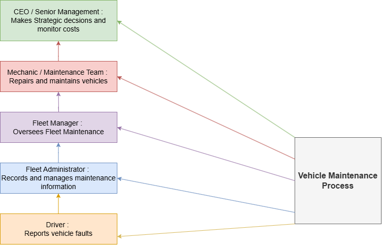
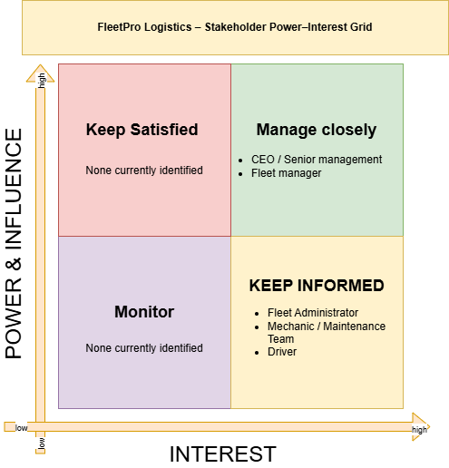
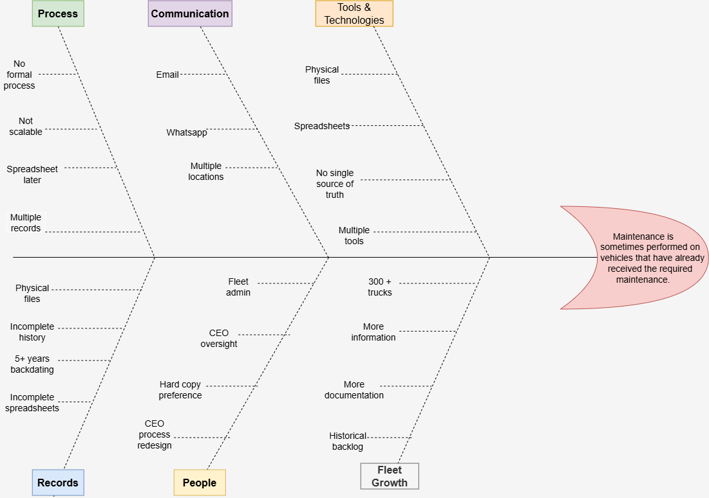
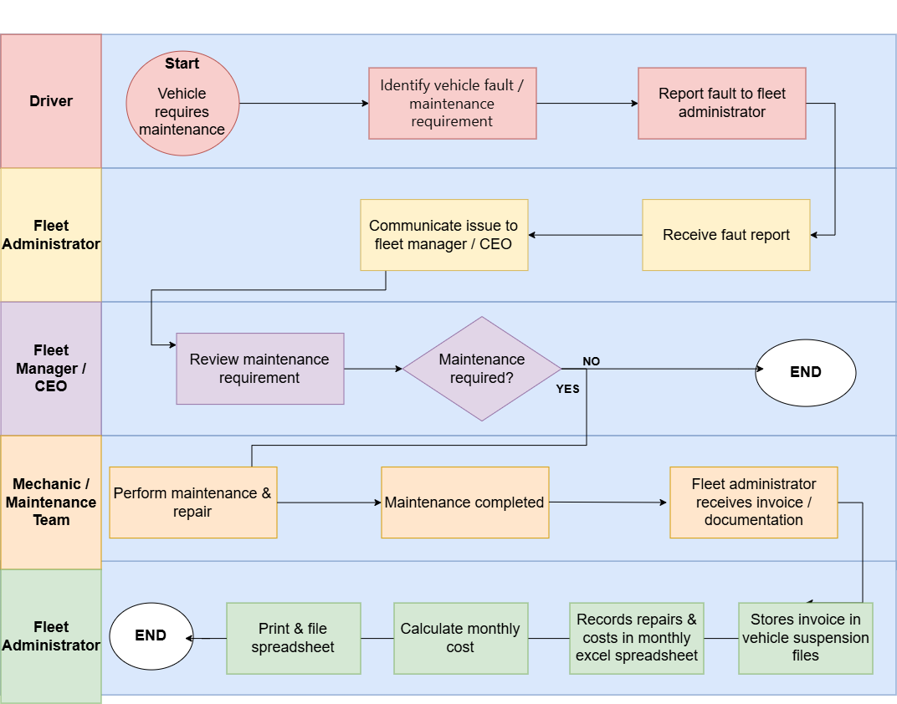
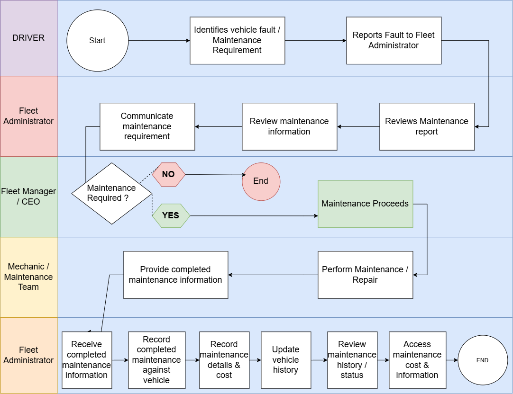

# FleetPro Logistics

## Vehicle Maintenance Management System

### Business Analysis Case Study

---

**Project Type:** Business Analysis + Systems Analysis + Software Development

**Current Stage:** Business Analysis Complete — Systems Analysis In Progress

**Prepared by:** Caleb Nayager

---

## Table of Contents

1. [Business Problem](#1-business-problem)
2. [Stakeholder Analysis](#2-stakeholder-analysis)
3. [Stakeholder Matrix](#3-stakeholder-matrix)
4. [Investigation](#4-investigation)
5. [Root Cause Analysis](#5-root-cause-analysis)
6. [Business Requirements](#6-business-requirements)
7. [As-Is Process](#7-as-is-process)
8. [To-Be Process](#8-to-be-process)
9. [Gap Analysis](#9-gap-analysis)
10. [Solution Evaluation](#10-solution-evaluation)
11. [Change and Implementation Planning](#11-change-and-implementation-planning)

---

# 1. Business Problem

FleetPro Logistics has a significant vehicle maintenance-recording problem. Maintenance information has been managed through a combination of physical vehicle files, spreadsheets and communication channels such as WhatsApp and email. As the fleet grew to more than 300 trucks, the volume of maintenance information became increasingly difficult to manage and track consistently.

This has resulted in reduced visibility of vehicle maintenance history, difficulty verifying whether required maintenance has already been completed, incomplete historical records and increased risk of unnecessary or repeated maintenance. These issues can contribute to vehicle downtime and unnecessary maintenance costs.

The investigation identified that the underlying business problem is not simply the use of paper records or spreadsheets, but the lack of a formal and scalable maintenance-recording process that can support the size of the fleet and the increasing volume of maintenance information.

## 2. Business Impact

The maintenance-recording problem affects FleetPro's ability to manage and monitor vehicle maintenance effectively.

The identified impacts include:

- Reduced visibility of vehicle maintenance history.
- Difficulty verifying whether maintenance has already been completed.
- Incomplete historical maintenance information.
- Increased risk of repeated or unnecessary maintenance.
- Increased difficulty managing maintenance information as the fleet grows.
- Difficulty monitoring maintenance costs consistently.
- Potential contribution to vehicle downtime and unnecessary maintenance expenditure.

## 3. Root Cause Summary

The investigation and root cause analysis identified that the underlying issue was the lack of a formal and scalable maintenance-recording process.

The original physical-file approach was manageable when the fleet was smaller. However, as the fleet grew to more than 300 trucks, the existing process became increasingly difficult to manage.

A spreadsheet-based process was later introduced to improve the recording and tracking of maintenance information. However, the requirement to reconstruct more than five years of historical information across more than 300 trucks created a significant backlog and resulted in incomplete records.

The root cause was therefore identified as the lack of a formal maintenance-recording process designed to scale with fleet growth and increasing information volume.

## 4. Problem Scope

The scope of the business problem includes the recording, storage, retrieval, tracking and management of vehicle maintenance information.

The analysis focuses on the current maintenance-recording process and the information used by the Fleet Administrator, Fleet Manager, Mechanic / Maintenance Team, Drivers and CEO / Senior Management.

The scope does not include the development of the proposed technical solution at this stage. The solution will be defined during the later systems analysis and design stages.

## 5. Conclusion

FleetPro requires an improved approach to vehicle maintenance-recording that can provide more consistent management of maintenance information and support the current size and future growth of the fleet.

The business problem and its impacts provide the basis for the stakeholder analysis, investigation, root cause analysis and business requirements developed during the business analysis process.

---

# 2. Stakeholder Analysis

## 1. Purpose

The purpose of this stakeholder analysis is to identify the individuals and groups involved in FleetPro's vehicle maintenance process and understand their roles, needs and concerns.

## 2. Stakeholders

| Stakeholder | Role in the process | What do they need? |
|---|---|---|
| Driver | Reports vehicle faults and issues | An easy way to report vehicle problems |
| Fleet Administrator | Records and manages maintenance information | Accurate and centralised maintenance records |
| Fleet Manager | Oversees fleet maintenance | Visibility of vehicle status and upcoming maintenance and fleet performance |
| Mechanic / Maintenance Team | Repairs and maintains company vehicles | Accurate information about reported faults, required repairs and previous maintenance history |
| CEO / Senior Management | Makes strategic decisions regarding fleet performance, operational costs and business investment | Accurate financial reporting and high-level maintenance information to support decision-making |

## 3. Stakeholder Diagram

The following diagram illustrates the stakeholders involved in the vehicle maintenance process.

---

# 3. Stakeholder Matrix

## 1. Purpose

The purpose of this stakeholder matrix is to assess and prioritise the stakeholders identified during the stakeholder analysis.

The matrix evaluates each stakeholder based on their level of power or influence over the vehicle maintenance process and their level of interest in the problem and potential improvements.

This helps determine how each stakeholder should be engaged during the business analysis and development of the proposed solution.

## 2. Power and Interest

The stakeholder matrix uses two main factors:

### Power / Influence

Power or influence refers to the level of authority a stakeholder has to make decisions, approve changes, influence business processes or affect the outcome of the project.

### Interest

Interest refers to how directly a stakeholder is affected by the vehicle maintenance problem and how interested they are in the outcome of the project.

## 3. Stakeholder Matrix

| Stakeholder | Power / Influence | Interest | Engagement Approach |
|---|---|---|---|
| CEO / Senior Management | High | High | Manage Closely |
| Fleet Manager | High | High | Manage Closely |
| Fleet Administrator | Low | High | Keep Informed |
| Mechanic / Maintenance Team | Low | High | Keep Informed |
| Driver | Low | High | Keep Informed |

## 4. Stakeholder Prioritisation

### CEO / Senior Management

**Power / Influence:** High

**Interest:** High

**Engagement Approach:** Manage Closely

CEO / Senior Management has a high level of influence because management is involved in decisions regarding business processes, operational costs, fleet performance and potential investment in improvements.

Their interest is also high because vehicle maintenance costs, operational efficiency and fleet performance have a direct impact on the business.

### Fleet Manager

**Power / Influence:** High

**Interest:** High

**Engagement Approach:** Manage Closely

The Fleet Manager has a high level of influence because they oversee fleet maintenance and require information about vehicle status, upcoming maintenance and fleet performance.

Their interest is high because the current maintenance-recording problems directly affect their ability to monitor and manage the fleet.

### Fleet Administrator

**Power / Influence:** Low

**Interest:** High

**Engagement Approach:** Keep Informed

The Fleet Administrator has a high level of involvement in the maintenance-recording process because they are responsible for recording and managing maintenance information.

However, their level of influence over the overall business process is considered low because they are responsible for maintaining records but do not have final authority over major changes to the maintenance process.

Their interest is high because they work directly with the maintenance records and are affected by incomplete historical information, spreadsheet updates and the use of multiple sources of information.

### Mechanic / Maintenance Team

**Power / Influence:** Low

**Interest:** High

**Engagement Approach:** Keep Informed

The Mechanic / Maintenance Team has a high level of involvement in the maintenance process because they perform vehicle repairs and provide information about vehicle faults and completed maintenance.

However, their level of influence over the overall maintenance process is considered low because they do not normally make decisions about how the business manages its maintenance-recording process.

Their interest is high because accurate maintenance history can help them understand previous repairs and determine what maintenance is required.

### Driver

**Power / Influence:** Low

**Interest:** High

**Engagement Approach:** Keep Informed

The Driver has a low level of influence over the overall maintenance process because they do not normally make decisions about how vehicle maintenance is managed.

However, their interest is high because drivers are directly involved in identifying and reporting vehicle faults and issues.

Keeping drivers informed and allowing them to provide relevant maintenance information is therefore important to the maintenance process.

## 5. Stakeholder Matrix Diagram

The following diagram illustrates the stakeholders according to their level of power or influence and interest.

---

# 4. Investigation

## 1. Purpose

The purpose of this investigation is to understand why FleetPro's vehicle maintenance information is difficult to track accurately and why maintenance may sometimes be repeated on vehicles that have already received the required maintenance.

The investigation focuses on the existing maintenance-recording process, the people responsible for maintaining records, where maintenance information is stored, how information is communicated, and how the process changed as the fleet grew.

## 2. Investigation Approach

The investigation was conducted by examining the existing vehicle maintenance-recording process and asking a series of questions to identify how maintenance information is recorded, stored, updated and communicated.

The investigation also examined how the process changed as the fleet expanded to more than 300 trucks and why the later spreadsheet process did not completely resolve the problem.

The findings from this investigation were used as the basis for the Root Cause Analysis and 5 Whys analysis.

## 3. Problem Being Investigated

Maintenance is sometimes performed on vehicles that have already received the required maintenance.

## Why 1?

Maintenance information is recorded across WhatsApp, spreadsheets and paper documentation, making it difficult to track previous maintenance accurately.

## Why 2?

Why is maintenance information recorded across multiple channels?

## 4. Investigation: Maintenance Information Across Multiple Channels

### Investigation Questions and Answers

**1. Is there a standard process that needs to be followed when recording information?**

**Answer:**

There was no standard process to be followed initially. Files were kept for each vehicle where maintenance invoices were stored, but maintenance information was not accurately recorded in the spreadsheet.

**2. Who is responsible for recording maintenance information?**

**Answer:**

The Fleet Administrator is responsible for recording maintenance information and drawing up spreadsheets for each vehicle. However, historical documentation had not been recorded over the years, resulting in incomplete information.

**3. Where is the official record?**

**Answer:**

The official maintenance documentation is kept in physical suspension files. However, as the fleet grew to more than 300 trucks, the number of physical files increased and storage space became difficult to manage.

**4. How is maintenance information communicated?**

**Answer:**

Maintenance information is communicated through email and WhatsApp.

### Findings

| Finding | What the evidence shows |
|---|---|
| No standard process | There was no standardised process for recording maintenance information initially. |
| Incomplete historical information | The Fleet Administrator was responsible for the spreadsheets, but historical information was incomplete. |
| Physical records | Official maintenance documentation was stored in physical suspension files, which became increasingly difficult to manage as the fleet grew beyond 300 trucks. |
| Multiple communication channels | Maintenance information was communicated through email and WhatsApp, meaning information could exist across multiple locations. |

### Conclusion

The investigation found that maintenance information was not managed through one standardised recording process. Maintenance documentation was kept in physical vehicle suspension files, while additional information was recorded in spreadsheets and communicated through email and WhatsApp.

The Fleet Administrator was responsible for maintaining the spreadsheet records, but historical information was incomplete. In addition, the growth of the fleet to more than 300 trucks increased the volume of physical documentation and made the existing process more difficult to manage.

These findings indicate that the maintenance-recording process relied on multiple sources of information rather than a single, consistent method for maintaining and verifying vehicle maintenance history.

## 5. Investigation: Standardised Maintenance-Recording Process

### Why 3?

Why was there no standardised process for recording maintenance information?

### Investigation Questions and Answers

**1. Was a formal maintenance-recording procedure ever created?**

**Answer:**

No. The process had been to keep the invoices in files for each vehicle.

**2. Was there a documented process?**

**Answer:**

The only process was to keep the invoices in the files.

**3. Were employees told how maintenance information should be recorded?**

**Answer:**

Later on, it was decided in the business to draw up spreadsheets for each vehicle and record the invoices according to dates. However, it had not been possible to complete all 300 trucks because the information had to be backdated by over five years. This led to only certain trucks having completed spreadsheets.

**4. Was there a standard template?**

**Answer:**

A template for the spreadsheets was drawn up.

**5. Was there someone responsible for checking that records were updated?**

**Answer:**

The CEO was responsible for checking if records were updated. He checked whether records were being updated and whether files were being completed so that he could easily keep track of the documentation. However, there was too much backdated paperwork to complete.

**6. Was the spreadsheet considered the official source of truth?**

**Answer:**

No. The spreadsheet contained the maintenance records and totals, but the official source was the invoices stored in the suspension files.

**7. Were there procedures for updating records after a repair?**

**Answer:**

Yes. After each repair was completed, the invoices were kept in the suspension file for the relevant vehicle. After the spreadsheet-recording process was implemented, the spreadsheet also had to be updated with details of the work completed, the cost of each repair and the total maintenance cost for each vehicle at the end of each month.

### Findings

| Finding | What the evidence shows |
|---|---|
| No original formal process | Maintenance records were originally kept as invoices in vehicle files. |
| Spreadsheet process introduced later | The business later introduced spreadsheets to organise maintenance information. |
| Backdated information | The spreadsheet process had to capture more than five years of historical records across 300+ vehicles, making completion difficult. |
| Standard template exists | A spreadsheet template was created, so the issue was not the absence of a template. |
| Management oversight existed | The CEO checked whether records and files were being maintained. |
| Invoices remain the official record | The spreadsheet was a tracking and summary tool; the invoices remained the official source documentation. |
| Multiple records must be maintained | After repairs, invoices were filed and the spreadsheet also had to be updated with maintenance details and costs. |

### Conclusion

The investigation found that the business originally relied on keeping maintenance invoices in physical vehicle files rather than following a formal maintenance-recording procedure. A more structured spreadsheet process was introduced later, but it had to be applied retrospectively to more than five years of maintenance records across more than 300 trucks. This created a significant backlog and made it difficult to complete the records for every vehicle.

Although a standard spreadsheet template and management oversight were introduced, the spreadsheet was not considered the official source of truth. The maintenance invoices stored in the physical suspension files remained the official source documentation. The process therefore required information to be maintained across both physical files and spreadsheets.

The investigation indicates that the absence of a formal, scalable recording process contributed to difficulties in keeping maintenance information complete, consistent and up to date.

---

## 6. Investigation: Growth of the Fleet and Physical Records

### Why 4?

Why did the business rely on physical files for maintenance tracking for such a long period?

### Investigation Questions and Answers

**1. Why was the paper-based process originally used?**

**Answer:**

The fleet was smaller at the time, so managing physical files and maintenance documentation was easier.

**2. What changed as the business grew?**

**Answer:**

The fleet expanded significantly, but the existing maintenance-recording processes were not updated to accommodate the increased number of vehicles and the larger volume of documentation.

**3. Why did the business continue using physical documentation?**

**Answer:**

The CEO preferred paper-based records and hard copies because he was concerned about the possibility of losing data.

**4. What happened when the fleet became harder to manage?**

**Answer:**

The CEO began losing visibility of vehicle maintenance information, and there were instances where vehicles were maintained again even though the required maintenance had already been completed. This resulted in unnecessary maintenance costs for the business.

**5. What action was taken to improve maintenance tracking?**

**Answer:**

A spreadsheet-based maintenance-recording process was introduced to provide more detailed records of maintenance performed on each vehicle, including maintenance dates, repair details and costs.

**6. Why did the spreadsheet process not immediately solve the problem?**

**Answer:**

The business wanted more than five years of historical maintenance information to be captured in the spreadsheets. With a fleet of more than 300 trucks, this created a significant backlog and meant that some vehicle spreadsheets remained incomplete.

### Findings

| Finding | What the evidence shows |
|---|---|
| Paper-based process was originally manageable | The fleet was smaller, so physical files and maintenance documentation were easier to manage. |
| Fleet grew significantly | The fleet expanded to more than 300 trucks, creating a much larger volume of maintenance information and documentation. |
| Processes were not updated as the fleet grew | The existing maintenance-recording process remained largely unchanged despite the significant increase in fleet size. |
| CEO preferred physical records | The CEO preferred hard-copy records because of concerns about losing data. |
| Management visibility became more difficult | The growth of the fleet and documentation made it harder to maintain visibility of vehicle maintenance. |
| Duplicate maintenance occurred | Reduced visibility contributed to instances where vehicles received maintenance even though the required maintenance had already been completed. |
| Spreadsheet process introduced later | The business introduced spreadsheets to improve the organisation and tracking of maintenance information. |
| Historical backlog was created | The spreadsheet process had to capture more than five years of historical maintenance records across more than 300 trucks. |
| Some records remained incomplete | The volume of backdated information made it difficult to complete the spreadsheets for all vehicles. |

### Conclusion

The investigation found that the original paper-based maintenance process was manageable when the fleet was smaller. However, the fleet later expanded to more than 300 trucks, significantly increasing the volume of maintenance information and physical documentation.

The existing process was not updated at the same rate as the growth of the fleet. The CEO continued to prefer hard-copy records because of concerns about losing data, while management visibility became more difficult as the amount of information increased.

A spreadsheet process was eventually introduced to improve maintenance tracking, but the requirement to backdate more than five years of information across more than 300 trucks created a significant backlog. Therefore, the spreadsheet process improved the structure of the information but did not immediately resolve the underlying record-management difficulties.

---

## 7. Investigation: Maintenance-Recording Process and Fleet Growth

### Why 5?

Why were the maintenance-recording processes not updated when the fleet grew significantly?

### Investigation Questions and Answers

**1. Was there an original formal process for recording maintenance?**

**Answer:**

No. There was no formal maintenance-recording process initially. Maintenance information was mainly kept through invoices stored in the vehicle files.

**2. When was the spreadsheet maintenance process introduced?**

**Answer:**

The spreadsheet process was introduced later to provide a more detailed way of recording and tracking maintenance information for each truck.

**3. Why was the spreadsheet process introduced?**

**Answer:**

The CEO wanted a detailed record for each truck that included maintenance information, individual costs, monthly totals and yearly totals.

**4. Who was responsible for redesigning the maintenance-recording process?**

**Answer:**

The CEO was responsible for redesigning the maintenance-recording process and introduced the spreadsheet-based approach.

**5. Why was the original process not changed earlier?**

**Answer:**

The fleet was smaller at the time, so managing the physical files and maintenance documentation was not considered difficult. As the fleet grew, the same process became increasingly difficult to manage.

**6. Did management recognise the existing process as too difficult to manage?**

**Answer:**

No. Management did not initially recognise the process as being too difficult to manage. The expectation was that the required work would be completed using the existing approach.

**7. Was another alternative process considered before the spreadsheet process?**

**Answer:**

No. The CEO wanted a detailed spreadsheet for each truck that could record maintenance information and costs for each month and year.

**8. Why did the spreadsheet process become difficult to complete?**

**Answer:**

The business wanted to backdate more than five years of maintenance information across more than 300 trucks. This created a large volume of historical information that needed to be captured.

**9. Why were the spreadsheets printed and filed?**

**Answer:**

The CEO preferred hard-copy records because of concerns about losing data. The spreadsheets were therefore intended to be printed and kept in the vehicle files.

**10. Has the spreadsheet process completely resolved the maintenance-recording problem?**

**Answer:**

No. Although the spreadsheets provide more detailed maintenance information, backdating more than five years of records for more than 300 trucks has been difficult to complete, and some vehicle records remain incomplete.

### Findings

| Finding | What the evidence shows |
|---|---|
| No original maintenance-recording process | There was no formal process for recording maintenance information initially; maintenance was mainly documented through invoices kept in vehicle files. |
| Spreadsheet process introduced later | A structured spreadsheet process was introduced later to provide more detailed maintenance tracking. |
| CEO introduced the new process | The CEO was responsible for redesigning the maintenance-recording process and introducing the spreadsheet approach. |
| Fleet growth made the process difficult | The original process was manageable when the fleet was smaller but became increasingly difficult as the fleet grew to more than 300 trucks. |
| Detailed spreadsheet requirements | Each truck's spreadsheet was expected to contain maintenance details, individual costs, monthly totals and yearly totals. |
| Historical records created a major backlog | More than five years of maintenance information had to be backdated across more than 300 trucks, creating a significant workload. |
| Backdating was difficult to complete | The volume of historical information made it difficult to complete spreadsheets for all vehicles consistently. |
| Hard-copy records remained important | The CEO preferred hard copies because of concerns about data loss, so spreadsheets were intended to be printed and filed. |
| New process did not fully resolve the issue | Although spreadsheets provided more detailed tracking, the historical backlog meant that some vehicle records remained incomplete. |

### Conclusion

The investigation found that FleetPro's maintenance-recording process was not formally established or designed to scale with the growth of the fleet. The original physical-file approach was manageable when the fleet was smaller, but the same approach became increasingly difficult as the number of vehicles and volume of maintenance information increased.

A spreadsheet-based process was later introduced to provide more detailed maintenance records and financial information for each truck. However, the requirement to backdate more than five years of maintenance information across more than 300 trucks created a significant workload and resulted in incomplete records for some vehicles.

The investigation therefore indicates that the main issue was not simply the use of physical files or spreadsheets. The deeper issue was that the maintenance-recording process had not been formally designed to accommodate the growth of the fleet and the increasing volume of maintenance information.

## 8. Overall Investigation Conclusion

The investigation identified several factors affecting FleetPro's vehicle maintenance-recording process. These included the absence of a formal standardised process initially, incomplete historical maintenance information, reliance on physical suspension files, multiple communication channels and the significant growth of the fleet.

The later introduction of spreadsheets provided a more structured method of recording maintenance information. However, the requirement to reconstruct more than five years of historical maintenance information across more than 300 trucks created a significant backlog, meaning that some vehicle records remained incomplete.

Overall, the investigation indicates that the maintenance-recording process was not formally established or designed to scale with the growth of the fleet and the increasing volume of maintenance information. These findings will be used in the Root Cause Analysis to identify the underlying cause of the problem.

---

# 5. Root Cause Analysis

## 1. Purpose

The purpose of this root cause analysis is to identify the underlying cause of the vehicle maintenance-recording problem identified during the investigation.

The analysis uses the findings from the investigation and the 5 Whys technique to trace the problem beyond its immediate symptoms and identify the underlying cause.

## 2. Problem Being Analysed

Maintenance is sometimes performed on vehicles that have already received the required maintenance.

This problem is associated with difficulties in accurately tracking previous maintenance information across physical files, spreadsheets and communication channels.

## 3. Fishbone Analysis

The Fishbone diagram was used to organise the contributing factors
identified during the investigation into categories and identify
relationships between the factors affecting the maintenance-recording
process.

## 4. Root Cause

The underlying root cause identified is that the business did not have a formal, scalable maintenance-recording process that could accommodate the growth of the fleet and the increasing volume of maintenance information.

The original physical-file approach was manageable when the fleet was smaller. However, as the fleet grew to more than 300 trucks, the existing process became increasingly difficult to manage.

A spreadsheet-based process was later introduced to improve the recording and tracking of maintenance information. However, the requirement to reconstruct more than five years of historical maintenance information across more than 300 trucks created a significant backlog and resulted in incomplete records.

Therefore, the root cause was not simply the use of physical files, spreadsheets, WhatsApp or email. The deeper issue was that the maintenance-recording process had not been formally designed to scale with the growth of the fleet and the increasing volume of maintenance information.

## 5. Root Cause vs Contributing Factors

| Category | Finding |
|---|---|
| Root Cause | The maintenance-recording process was not formally established or designed to scale with fleet growth and increasing information volume. |
| Contributing Factor | The fleet grew to more than 300 trucks. |
| Contributing Factor | Maintenance documentation remained largely paper-based. |
| Contributing Factor | Information was communicated through multiple channels, including email and WhatsApp. |
| Contributing Factor | The spreadsheet process was introduced later. |
| Contributing Factor | More than five years of historical information had to be backdated. |
| Contributing Factor | Some vehicle spreadsheetsV remained incomplete. |

## 6. Root Cause Analysis Conclusion

The root cause analysis confirms that the underlying issue was not the use of physical files, spreadsheets, email or WhatsApp individually. These were methods used to record and communicate maintenance information, but the investigation showed that the maintenance-recording process was not formally established or designed to scale with the growth of the fleet.

The original process was manageable when the fleet was smaller, but the growth to more than 300 trucks significantly increased the volume of maintenance information that needed to be recorded and managed. The later introduction of spreadsheets provided a more structured way of tracking maintenance information, but the requirement to backdate more than five years of records created a significant backlog and resulted in incomplete vehicle records.

The root cause therefore relates to the lack of a formal and scalable maintenance-recording process capable of supporting the size of the fleet and the increasing volume of maintenance information.

This root cause will be used as the basis for defining the business requirements for an improved maintenance-recording process.

---

# 6. Business Requirements

## 1. Purpose

The purpose of this document is to define the business requirements for improving FleetPro Logistics' vehicle maintenance-recording process.

The requirements are derived from the findings identified during the stakeholder analysis, investigation and root cause analysis.

These requirements describe the business needs that the proposed solution must address to improve the recording, tracking, retrieval and management of vehicle maintenance information.

The business requirements will provide the foundation for defining the functional and non-functional requirements of the proposed system during the systems analysis phase.

## 2. Business Need

FleetPro needs to improve the way vehicle maintenance information is recorded, stored, accessed and managed.

The current maintenance-recording process relies on physical suspension files, spreadsheets, email and WhatsApp. As the fleet grew to more than 300 trucks, the existing process became increasingly difficult to manage and maintain accurately.

The business therefore needs a more consistent and scalable approach to managing vehicle maintenance information so that previous maintenance can be identified, maintenance records can be maintained accurately, and management can obtain reliable information about vehicle maintenance and associated costs.

## 3. Business Objectives

The proposed improvement should support FleetPro in achieving the following business objectives:

- Improve the accuracy and completeness of vehicle maintenance records.
- Improve the ability to identify previous maintenance performed on each vehicle.
- Improve the visibility of vehicle maintenance information.
- Improve the recording and monitoring of maintenance costs.
- Reduce difficulties associated with retrieving historical maintenance information.
- Establish a maintenance-recording process that can support the size and continued growth of the fleet.
- Provide structured maintenance information to support management reporting and decision-making.

## 4. Business Requirements

### BR-001 — Centralised Maintenance Information

**Requirement:**  

FleetPro requires a centralised method of maintaining and accessing vehicle maintenance information.

**Business Reason:**  

Maintenance information is currently recorded across WhatsApp, spreadsheets and paper documentation, making it difficult to accurately track previous maintenance.

**Source:**  

Investigation — Maintenance Information Across Multiple Channels.

---

### BR-002 — Accurate Maintenance History

**Requirement:**  

FleetPro requires accurate maintenance history to be maintained for each vehicle.

**Business Reason:**  

The business needs to determine what maintenance has previously been performed on a vehicle to reduce the risk of maintenance being performed when the required maintenance has already been completed.

**Source:**  

Investigation — Problem Being Investigated.

---

### BR-003 — Maintenance Record Management

**Requirement:**  

FleetPro requires a standardised method for recording vehicle maintenance information, including the maintenance performed, maintenance date and associated details.

**Business Reason:**  

The investigation found that there was no formal maintenance-recording process initially and that maintenance information was recorded through different methods.

**Source:**  

Investigation — Standardised Maintenance-Recording Process.

---

### BR-004 — Maintenance Cost Tracking

**Requirement:**  

FleetPro requires maintenance costs to be recorded and associated with the relevant vehicle and maintenance activity.

**Business Reason:**  

The spreadsheet process was introduced to record the individual cost of repairs and calculate monthly and yearly maintenance totals for each vehicle. This information supports the monitoring of maintenance expenditure.

**Source:**  

Investigation — Standardised Maintenance-Recording Process.

---

### BR-005 — Vehicle Maintenance Status Visibility

**Requirement:**  

FleetPro requires visibility of the maintenance status and history of each vehicle.

**Business Reason:**  

The investigation found that management visibility became more difficult as the fleet grew and maintenance information became harder to manage. Improved visibility can help the business determine whether maintenance has already been performed on a vehicle.

**Source:**  

Investigation — Growth of Fleet and Physical Records.

---

### BR-006 — Maintenance Information Retrieval

**Requirement:**  

FleetPro requires maintenance information to be easily retrieved for individual vehicles when required.

**Business Reason:**  

Maintenance information is currently distributed across physical suspension files, spreadsheets, email and WhatsApp. This makes it difficult to locate and verify previous maintenance information efficiently.

**Source:**  

Investigation — Maintenance Information Across Multiple Channels.

---

### BR-007 — Scalable Maintenance-Recording Process

**Requirement:**  

FleetPro requires a maintenance-recording process that can accommodate the current size of the fleet and future growth in the volume of maintenance information.

**Business Reason:**  

The fleet grew to more than 300 trucks, while the existing maintenance-recording process was not updated to accommodate the increased volume of vehicles and information. The investigation identified the lack of scalability as the underlying root cause.

**Source:**  

Investigation — Maintenance-Recording Process and Fleet Growth.

---

### BR-008 — Maintenance Reporting

**Requirement:**  

FleetPro requires maintenance information to be available in a structured form that supports maintenance and financial reporting.

**Business Reason:**  

The later spreadsheet process was designed to record repair details, individual maintenance costs and monthly and yearly maintenance totals for each vehicle. These records provide information that can support management monitoring and decision-making.

**Source:**  

Investigation — Standardised Maintenance-Recording Process and Maintenance-Recording Process and Fleet Growth.

## 5. Requirement Prioritisation

The business requirements have been prioritised using the MoSCoW
prioritisation technique.

The prioritisation is based on the relationship between each
requirement and the business problem identified during the
investigation and root cause analysis.

The priorities below represent the proposed scope for the FleetPro
solution.

| Requirement | Description | Priority |
|---|---|---|
| BR-001 | Centralised Maintenance Information | Must Have |
| BR-002 | Accurate Maintenance History | Must Have |
| BR-003 | Maintenance Record Management | Must Have |
| BR-004 | Maintenance Cost Tracking | Should Have |
| BR-005 | Vehicle Maintenance Status Visibility | Should Have |
| BR-006 | Maintenance Information Retrieval | Must Have |
| BR-007 | Scalable Maintenance-Recording Process | Must Have |
| BR-008 | Maintenance Reporting | Should Have |

## 6. Requirements Traceability

Requirements traceability is used to establish a clear relationship
between the findings identified during the investigation, the business
requirements and the business objectives they support.

This ensures that the business requirements are based on identified
business needs and problems rather than being introduced without
supporting evidence.

| Requirement | Investigation Finding | Business Objective |
|---|---|---|
| BR-001 | Maintenance information is recorded across WhatsApp, spreadsheets and paper documentation. | Improve the accuracy and accessibility of vehicle maintenance records. |
| BR-002 | Previous maintenance information can be difficult to track accurately. | Improve the ability to identify previous maintenance performed on each vehicle. |
| BR-003 | There was no formal maintenance-recording process initially. | Establish a consistent method for recording maintenance information. |
| BR-004 | The spreadsheet process recorded individual repair costs and monthly and yearly maintenance totals. | Improve the recording and monitoring of maintenance costs. |
| BR-005 | Management visibility became more difficult as the fleet grew and maintenance information became harder to manage. | Improve visibility of vehicle maintenance information. |
| BR-006 | Maintenance information is distributed across physical files, spreadsheets, email and WhatsApp. | Improve the ability to retrieve historical maintenance information. |
| BR-007 | The maintenance-recording process was not updated as the fleet grew to more than 300 trucks. | Establish a maintenance-recording process that can support fleet growth and increasing information volume. |
| BR-008 | The spreadsheet process provided repair details, individual costs and monthly and yearly totals. | Provide structured maintenance information to support management reporting and decision-making. |

## 7. Assumptions and Constraints

### 7.1 Assumptions

The following assumptions have been made for the purpose of analysing
and designing the proposed FleetPro solution:

- Existing vehicle maintenance information will be used as a source for
  populating the proposed maintenance records.
- Users responsible for vehicle maintenance administration will provide
  the required maintenance information when records are created or
  updated.
- The proposed solution will need to support the maintenance information
  currently required by the business, including maintenance dates,
  maintenance details and associated costs.
- Historical maintenance information may be incomplete because the
  investigation identified gaps in records and incomplete historical
  spreadsheets.

### 7.2 Constraints

The following constraints have been identified from the investigation:

- Historical maintenance information is incomplete for some vehicles.
- More than five years of historical maintenance information may need to
  be reconstructed or captured.
- The fleet contains more than 300 trucks, creating a significant volume
  of maintenance information to manage.
- Existing maintenance information is distributed across physical files,
  spreadsheets, email and WhatsApp.
- Physical suspension files remain the official source of maintenance
  documentation in the existing process.

  ## 8. Requirement Validation

The business requirements were reviewed against the findings from the
investigation and root cause analysis to determine whether they are
relevant, supported by evidence, clearly defined and appropriate at the
business level.

The validation also checks that the requirements do not unnecessarily
duplicate one another and that they describe business needs rather than
specific technical solutions.

| Requirement | Relevant | Supported by Investigation | Clear | Business-Focused | Validation Result |
|---|---|---|---|---|---|
| BR-001 | Yes | Yes | Yes | Yes | Valid |
| BR-002 | Yes | Yes | Yes | Yes | Valid |
| BR-003 | Yes | Yes | Yes | Yes | Valid |
| BR-004 | Yes | Yes | Yes | Yes | Valid |
| BR-005 | Yes | Yes | Yes | Yes | Valid |
| BR-006 | Yes | Yes | Yes | Yes | Valid |
| BR-007 | Yes | Yes | Yes | Yes | Valid |
| BR-008 | Yes | Yes | Yes | Yes | Valid |

### Validation Summary

The validation confirmed that all eight business requirements are
supported by findings identified during the investigation and root
cause analysis.

The requirements address the key business needs identified during the
analysis, including centralised maintenance information, accurate
maintenance history, standardised record management, cost tracking,
maintenance visibility, information retrieval, scalability and
reporting.

The requirements remain technology-independent and therefore provide a
suitable foundation for defining the solution requirements during the
systems analysis and design stages.

---

# 7. As-is Process

## 1. Purpose

The purpose of this document is to describe the current vehicle maintenance-recording process used by FleetPro Logistics.

The As-Is process documents how vehicle maintenance information is currently identified, communicated, recorded, stored and reviewed before any improvements are introduced.

The process is based on the findings identified during the stakeholder analysis, investigation and root cause analysis.

## 2. Current Vehicle Maintenance Process

The current vehicle maintenance process begins when a driver identifies a vehicle fault or maintenance requirement.

### 2.1 Fault Identification and Reporting

The driver identifies a fault or maintenance requirement and reports the issue to the Fleet Administrator.

### 2.2 Maintenance Review

The Fleet Administrator communicates the reported issue to the Fleet Manager and CEO / Senior Management.

The Fleet Manager and CEO / Senior Management review the reported maintenance requirement and determine whether maintenance should proceed.

### 2.3 Maintenance Performed

If maintenance is approved, the vehicle is taken for the required maintenance or repair.

The maintenance is performed by the Mechanic / Maintenance Team.

### 2.4 Invoice and Physical Record

Once the maintenance has been completed, the maintenance invoice or related documentation is received.

The invoice is stored in the vehicle's physical suspension file.

### 2.5 Excel Maintenance Recording

Maintenance information is also recorded using Excel spreadsheets.

A spreadsheet is prepared for each vehicle for each month. The spreadsheet records the repairs and maintenance performed during that month, along with the associated costs.

The monthly maintenance costs are calculated and the spreadsheet is printed and filed.

The monthly maintenance information is then used to calculate the vehicle's maintenance costs for the year.

### 2.6 Current Process Summary

The current process therefore involves several activities and sources of information, including driver reports, communication between stakeholders, physical vehicle suspension files, invoices and Excel spreadsheets.

The process provides a method of recording maintenance information, but the investigation identified difficulties in consistently managing and retrieving maintenance information as the fleet grew.

## 3. As-Is Process Swimlane Diagram

The following swimlane diagram illustrates the current vehicle maintenance process and shows the responsibilities of the stakeholders involved in the process.

---

# 8. To-be Process

## 1. Purpose

The purpose of this document is to describe the proposed future vehicle maintenance process for FleetPro Logistics.

The To-Be process describes how vehicle maintenance information should be identified, communicated, recorded, stored, accessed and reviewed after the current maintenance-recording process has been improved.

The proposed process is based on the business requirements identified during the business analysis and is intended to address the problems identified during the investigation and root cause analysis.

## 2. Proposed Vehicle Maintenance Process

The proposed vehicle maintenance process introduces a more structured and centralised approach to managing vehicle maintenance information.

The process is designed to improve the accuracy, accessibility, visibility and scalability of maintenance records while supporting maintenance cost tracking and reporting.

### 2.1 Fault Identification and Reporting

The process begins when a driver identifies a vehicle fault or maintenance requirement.

The driver reports the fault to the Fleet Administrator using the defined maintenance-reporting process.

The reported information should identify the relevant vehicle and provide sufficient details about the fault or maintenance requirement.

### 2.2 Maintenance Review

The Fleet Administrator reviews the reported maintenance requirement and communicates the relevant information to the Fleet Manager and CEO / Senior Management.

The Fleet Manager and CEO / Senior Management review the reported issue and determine whether maintenance should proceed.

If maintenance is not required, the maintenance request is recorded as not proceeding and the process ends.

If maintenance is required, the request proceeds to the maintenance stage.

### 2.3 Maintenance Performed

The Mechanic / Maintenance Team performs the required maintenance or repair.

Information about the maintenance performed is provided for recording once the work has been completed.

### 2.4 Maintenance Record Updated

After maintenance has been completed, the relevant maintenance information is recorded against the vehicle.

The maintenance record should include information such as:

- Vehicle identification
- Maintenance date
- Maintenance or repair performed
- Maintenance details
- Associated maintenance cost

The maintenance information is maintained using a standardised recording process.

### 2.5 Centralised Maintenance History

The completed maintenance record becomes part of the vehicle's maintenance history.

The maintenance history should be accessible when required so that users can determine what maintenance has previously been performed on the vehicle.

This provides a consistent source of maintenance information and reduces the need to search across multiple sources to identify previous maintenance.

### 2.6 Maintenance Status and Cost Monitoring

The recorded maintenance information is used to provide visibility of the maintenance status and history of individual vehicles.

Maintenance costs are associated with the relevant vehicle and maintenance activity.

This allows maintenance expenditure to be monitored and supports the calculation and review of maintenance costs.

### 2.7 Maintenance Reporting

The structured maintenance information is used to support maintenance and financial reporting.

Management should be able to use the available maintenance information to review vehicle maintenance activity, maintenance history and associated costs.

### 2.8 Historical Maintenance Information

Existing historical maintenance information should be reviewed and captured into the proposed maintenance records where reliable information is available.

Where historical information is incomplete, the missing information should be identified rather than assumed or fabricated.

Historical information can therefore be progressively incorporated without treating incomplete records as accurate information.

## 3. To-Be Process Summary

The proposed process establishes a more consistent approach to vehicle maintenance recording and information management.

The process provides a defined method for reporting vehicle faults, reviewing maintenance requirements, recording completed maintenance, maintaining vehicle maintenance history, tracking associated costs and producing structured maintenance information for reporting.

The proposed process is designed to support FleetPro's current fleet of more than 300 trucks while allowing the maintenance-recording process to accommodate future growth in vehicles and maintenance information.

## 4. Business Requirements Addressed

The proposed To-Be process addresses the business requirements identified during the business analysis.

| Requirement | How the To-Be Process Addresses It |
|---|---|
| BR-001 — Centralised Maintenance Information | Maintenance information is maintained using a centralised and structured recording process. |
| BR-002 — Accurate Maintenance History | Completed maintenance is recorded against the relevant vehicle to maintain its maintenance history. |
| BR-003 — Maintenance Record Management | A standardised process is used to record maintenance dates, details and associated information. |
| BR-004 — Maintenance Cost Tracking | Maintenance costs are recorded against the relevant vehicle and maintenance activity. |
| BR-005 — Vehicle Maintenance Status Visibility | Recorded maintenance information provides visibility of vehicle maintenance status and history. |
| BR-006 — Maintenance Information Retrieval | Vehicle maintenance history can be accessed when required without relying on multiple disconnected sources. |
| BR-007 — Scalable Maintenance-Recording Process | The proposed process is structured to support the current fleet and future growth in maintenance information. |
| BR-008 — Maintenance Reporting | Structured maintenance information supports maintenance and financial reporting. |

## 5. To-Be Process Swimlane Diagram

The following swimlane diagram illustrates the proposed future vehicle maintenance process and shows the responsibilities of the stakeholders involved.

---

# 9. Gap Analysis

## 1. Purpose

The purpose of this Gap Analysis is to identify the differences between FleetPro Logistics' current vehicle maintenance-recording process and the proposed future-state process.

The analysis compares the findings from the As-Is process with the requirements and improvements identified in the To-Be process.

The purpose is to identify the areas where the current process, information management and maintenance-recording practices do not currently meet the desired future state.

The identified gaps will be used to support the evaluation and selection of an appropriate solution for FleetPro's vehicle maintenance-recording problem.

## 2. Current State

FleetPro's current vehicle maintenance process relies on physical suspension files, Excel spreadsheets, email and WhatsApp to record, communicate and manage maintenance information.

Maintenance information is recorded through multiple methods and historical information is incomplete for some vehicles.

The current process became increasingly difficult to manage as the fleet grew to more than 300 trucks.

## 3. Future State

The proposed future process provides a more structured and centralised approach to recording, accessing and managing vehicle maintenance information.

Maintenance information is recorded against the relevant vehicle using a standardised process, including maintenance details, dates and associated costs.

The future process provides improved access to maintenance history, maintenance status information and structured information for maintenance and financial reporting.

The process is also intended to support the current fleet size and future growth in maintenance information.

## 4. Gap Analysis

The following gaps were identified by comparing FleetPro's current vehicle maintenance-recording process with the proposed future state.

| Area | Current State | Future State | Identified Gap |
|---|---|---|---|
| Maintenance Information | Maintenance information is recorded across physical files, spreadsheets, email and WhatsApp. | Maintenance information is maintained through a centralised and structured process. | No single, consistent method for maintaining maintenance information. |
| Maintenance History | Previous maintenance information can be difficult to locate and verify. | Vehicle maintenance history can be easily accessed when required. | Limited accessibility and visibility of historical maintenance information. |
| Record Management | Maintenance information is recorded using different methods. | Maintenance information is recorded using a standardised process. | Lack of a consistent maintenance-recording process. |
| Maintenance Costs | Costs are recorded through Excel spreadsheets and monthly and yearly calculations. | Maintenance costs are recorded against the relevant vehicle and maintenance activity. | Cost information is dependent on manual spreadsheet-based recording. |
| Maintenance Status | Management visibility of maintenance information becomes difficult as the volume of information increases. | Vehicle maintenance status and history are readily available. | Limited visibility of current vehicle maintenance status. |
| Information Retrieval | Information may need to be located across physical files, spreadsheets and communication channels. | Maintenance information can be retrieved for individual vehicles when required. | Retrieval of maintenance information is inefficient. |
| Scalability | The existing process became increasingly difficult to manage as the fleet grew beyond 300 trucks. | The maintenance-recording process can support the current fleet and future growth. | Existing process does not scale effectively with fleet and information growth. |
| Reporting | Maintenance information is compiled through spreadsheets and manual calculations. | Structured maintenance information supports maintenance and financial reporting. | Reporting depends on manually maintained information and calculations. |

## 5. Gap-to-Requirement Traceability

The identified gaps were compared with the business requirements to ensure that each gap is addressed by a defined business need.

| Gap | Related Business Requirement |
|---|---|
| No single, consistent method for maintaining maintenance information. | BR-001 — Centralised Maintenance Information |
| Limited accessibility and visibility of historical maintenance information. | BR-002 — Accurate Maintenance History |
| Lack of a consistent maintenance-recording process. | BR-003 — Maintenance Record Management |
| Cost information depends on manual spreadsheet-based recording. | BR-004 — Maintenance Cost Tracking |
| Limited visibility of current vehicle maintenance status. | BR-005 — Vehicle Maintenance Status Visibility |
| Retrieval of maintenance information is inefficient. | BR-006 — Maintenance Information Retrieval |
| Existing process does not scale effectively with fleet and information growth. | BR-007 — Scalable Maintenance-Recording Process |
| Reporting depends on manually maintained information and calculations. | BR-008 — Maintenance Reporting |

---

# 10. Solution Evaluation

## 1. Purpose

The purpose of this Solution Evaluation is to identify and evaluate potential approaches for addressing the gaps identified during the business analysis of FleetPro Logistics' vehicle maintenance-recording process.

The evaluation considers different solution approaches against the business requirements and identified business needs.

The purpose is to determine which approach could provide an appropriate response to FleetPro's maintenance-recording challenges while considering factors such as functionality, scalability, implementation effort and suitability for the business.

## 2. Evaluation Criteria

The potential solution approaches will be evaluated against criteria derived from FleetPro's business requirements and identified gaps.

The following criteria will be considered:

| Criterion | Description |
|---|---|
| Centralised Information | Ability to provide a consistent method for maintaining vehicle maintenance information. |
| Maintenance History | Ability to maintain and retrieve maintenance history for individual vehicles. |
| Record Management | Ability to support a standardised maintenance-recording process. |
| Cost Tracking | Ability to record and monitor maintenance costs. |
| Maintenance Visibility | Ability to provide visibility of vehicle maintenance status and history. |
| Information Retrieval | Ability to retrieve maintenance information efficiently when required. |
| Scalability | Ability to support the current fleet of more than 300 trucks and future growth. |
| Reporting | Ability to support structured maintenance and financial reporting. |
| Implementation Effort | Level of effort required to introduce and implement the solution. |
| Business Fit | How well the approach fits FleetPro's existing processes and requirements. |

## 3. Potential Solution Approaches

Three potential approaches were identified for addressing the gaps in FleetPro Logistics' vehicle maintenance-recording process.

### 3.1 Option 1 — Improve the Existing Process

FleetPro could retain its existing physical and Excel-based maintenance-recording approach while improving the processes and controls used to manage maintenance information.

Potential improvements could include standardised recording procedures, improved spreadsheet templates, clearly defined responsibilities, improved document organisation and regular reviews of maintenance records.

This approach would require less technological change and could potentially be implemented with limited disruption to the existing process.

However, the underlying reliance on physical records and manually maintained spreadsheets would remain.

### 3.2 Option 2 — Adopt Existing Fleet Management Software

FleetPro could adopt an existing fleet or vehicle maintenance management solution.

A suitable existing solution could potentially provide centralised maintenance information, vehicle maintenance histories, cost tracking, reporting and improved information retrieval.

This approach could reduce the amount of software development required by FleetPro.

However, the available functionality, configuration options, costs and compatibility with FleetPro's specific business requirements would need to be evaluated before implementation.

### 3.3 Option 3 — Develop a Custom FleetPro Solution

FleetPro could develop a custom vehicle maintenance-management solution based on the business requirements identified during the analysis.

A custom solution could be designed to support centralised maintenance information, vehicle maintenance history, maintenance costs, maintenance status, information retrieval and reporting.

This approach would provide greater control over the design of the solution and allow the system to be developed around FleetPro's specific processes and requirements.

However, developing a custom solution would require greater development effort and would introduce additional responsibilities for testing, implementation, maintenance and future enhancements.

## 4. Solution Evaluation

The potential solution approaches were evaluated against the criteria identified from FleetPro's business requirements and identified gaps.

| Evaluation Criterion | Improve Existing Process | Adopt Existing Software | Develop Custom Solution |
|---|---|---|---|
| Centralised Information | Low | High | High |
| Maintenance History | Medium | High | High |
| Record Management | Medium | High | High |
| Cost Tracking | Medium | High | High |
| Maintenance Visibility | Medium | High | High |
| Information Retrieval | Medium | High | High |
| Scalability | Low | High | High |
| Reporting | Medium | High | High |
| Implementation Effort | High | Medium | Low |
| Business Fit | Medium | Medium | High |

## 5. Solution Trade-offs

### Option 1 — Improve the Existing Process

The main advantage of improving the existing process is that it would require relatively little technological change and could be introduced with less disruption.

However, this approach would continue to rely heavily on physical records and manually maintained spreadsheets. As a result, some of the existing limitations relating to information retrieval, scalability and centralised information management would remain.

### Option 2 — Adopt Existing Fleet Management Software

The main advantage of adopting an existing solution is that FleetPro could gain access to established fleet and maintenance-management functionality without developing an entire system internally.

However, the organisation would need to evaluate whether the available functionality matches FleetPro's specific requirements. Costs, configuration, data migration, user training and integration requirements would also need to be considered.

### Option 3 — Develop a Custom FleetPro Solution

The main advantage of developing a custom solution is that the system could be designed specifically around FleetPro's identified business requirements and future process.

However, this approach would require greater development effort and would involve responsibilities for development, testing, deployment, maintenance and future enhancements.

## 6. Evaluation Outcome

Based on the evaluation criteria and the requirements identified during the business analysis, developing a custom FleetPro solution provides a strong fit for the requirements of this portfolio case study.

A custom solution would allow the identified business requirements to be translated into a system specifically designed around FleetPro's maintenance-recording process.

However, this evaluation does not imply that custom development would automatically be the most appropriate choice for a real-world implementation.

In a real business environment, the final solution decision would require further investigation into factors such as available budget, existing systems, commercial software options, implementation costs, technical resources, security requirements and stakeholder approval.

For the purposes of this case study, the custom solution will therefore be taken forward into the Systems Analysis and Design stage for further investigation and development.

---

# 11. Change And Implementation Planning

# Benefits Realisation

## 1. Purpose

The purpose of this Benefits Realisation document is to identify the expected business benefits of the proposed FleetPro maintenance-recording solution and describe how those benefits could be measured after implementation.

The benefits are linked to the business problems, requirements and gaps identified during the business analysis.

The purpose is to establish how FleetPro could determine whether the proposed change has improved the management of vehicle maintenance information and supported the organisation's operational needs.

## 2. Expected Business Benefits

The proposed solution is expected to provide the following business benefits:

| Benefit | Description | Related Business Requirements |
|---|---|---|
| Centralised Maintenance Information | Maintenance information is maintained through a structured and centralised process rather than being distributed across multiple sources. | BR-001 |
| Improved Maintenance History | Users can access a more complete and structured history of maintenance performed on individual vehicles. | BR-002 |
| Standardised Record Management | Maintenance information is recorded using a consistent process and defined information requirements. | BR-003 |
| Improved Cost Visibility | Maintenance costs can be associated with the relevant vehicle and maintenance activity, improving visibility of maintenance expenditure. | BR-004 |
| Improved Maintenance Visibility | Users can access information about vehicle maintenance status and history when required. | BR-005 |
| Faster Information Retrieval | Maintenance information can be retrieved without relying on multiple disconnected sources. | BR-006 |
| Improved Scalability | The maintenance-recording process can support the current fleet and accommodate future growth in maintenance information. | BR-007 |
| Improved Reporting | Structured maintenance information can support maintenance and financial reporting. | BR-008 |

## 3. Benefit Measurement

The benefits should be measured using appropriate operational indicators after implementation.

| Benefit | Suggested Measure | Expected Outcome |
|---|---|---|
| Centralised Maintenance Information | Number of maintenance information sources used during normal maintenance-recording activities. | Reduced reliance on disconnected sources for maintenance information. |
| Improved Maintenance History | Percentage of vehicles with accessible and sufficiently complete maintenance histories. | Improved availability of vehicle maintenance history. |
| Standardised Record Management | Percentage of maintenance records captured using the defined recording process. | Greater consistency in maintenance records. |
| Improved Cost Visibility | Percentage of maintenance records containing associated cost information where cost data is available. | Improved visibility of maintenance expenditure. |
| Improved Maintenance Visibility | Time required to determine the maintenance history or status of a vehicle. | Faster access to relevant maintenance information. |
| Faster Information Retrieval | Average time required to retrieve a vehicle's maintenance information. | Reduced time spent searching for maintenance records. |
| Improved Scalability | Ability of the process to maintain records as the number of vehicles and maintenance activities increases. | Process remains manageable as fleet and information volume grow. |
| Improved Reporting | Time and effort required to prepare maintenance information for reporting. | More structured and efficient reporting. |

## 4. Benefits Realisation Approach

Benefits should be reviewed at different stages after implementation.

### Initial Review

An initial review should be conducted after implementation to determine whether users have adopted the new maintenance-recording process and whether the solution is being used as intended.

### Operational Review

A further review should be conducted after the solution has been used for an appropriate period of normal operations.

This review should examine whether maintenance information is being recorded consistently and whether users are able to retrieve and use the information effectively.

### Ongoing Review

Benefits should continue to be monitored over time to determine whether the solution remains suitable as FleetPro's fleet and maintenance information requirements change.

Where expected benefits are not being achieved, the underlying causes should be investigated and appropriate improvements considered.

## 5. Benefits Realisation Limitations

The benefits identified in this document are expected benefits based on the proposed solution and the findings of the business analysis.

The FleetPro case study does not represent a confirmed production implementation within a real FleetPro Logistics environment. Therefore, actual improvements in maintenance costs, downtime, record accuracy or operational performance cannot be claimed without implementation data and appropriate measurement.

The proposed measures provide a framework that could be used to evaluate the solution after implementation.

## 6. Conclusion

The proposed FleetPro solution is expected to improve the management of vehicle maintenance information by providing a more structured, accessible and scalable maintenance-recording process.

The expected benefits are directly linked to the business requirements and gaps identified during the business analysis.

Benefits should be measured using defined operational indicators after implementation rather than assumed to have been achieved.

Ongoing measurement and review would allow FleetPro to determine whether the solution continues to provide value and whether further improvements are required.

